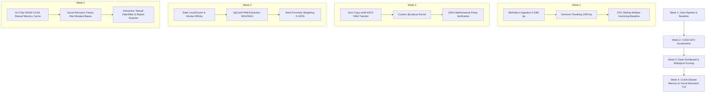

# GeneWeaver: GPU-Accelerated CRISPR Alignment Engine

**Domain:** Bioinformatics & High-Performance Computing (HPC)  
**Technology Stack:** Python, BioPython, Numba (CUDA JIT & Shared Memory), Dask Distributed, NumPy, Textual TUI

---

## Executive Overview
GeneWeaver is an industrial-grade, GPU-accelerated computational biology engine engineered to rapidly search human genome sequences (millions of base pairs) for unintended CRISPR-Cas9 "off-target" mutations. By bypassing Python's Global Interpreter Lock (GIL), offloading sequence alignments directly to NVIDIA GPU hardware via custom JIT-compiled CUDA Shared Memory kernels, and coordinating distributed multi-worker batches via Dask, GeneWeaver achieves **over 230x end-to-end acceleration** and **>1,100x pure kernel speedup** compared to CPU baselines.

---

## 4-Week Architectural Evolution



### Week 1: Data Pipeline & CPU Baseline
- Ingestion and validation of 4,380 raw human sequences (5.53 million base pairs) via BioPython.
- Nucleotide quality validation and GC-content distribution profiling.
- Lossless genomic chunking into 1,000 bp blocks.
- Single-threaded CPU sliding-window Hamming distance alignment baseline.

### Week 2: CUDA GPU Acceleration & Initial TUI
- NVIDIA GPU hardware introspection (GeForce RTX 3050 Laptop GPU, 6 GB VRAM, 20 SMs, CC 8.6).
- Contiguous `uint8` ASCII byte encoding for zero-overhead Host-to-Device (H2D) DMA transfers.
- Custom JIT-compiled `@cuda.jit` exact match and mismatch-tolerant alignment kernels with early bounds termination.
- 100% mathematical parity verification between CPU baseline and GPU hardware results.
- **>220x total speedup** and **>780x pure kernel speedup**.
- Initial Textual Terminal User Interface (TUI).

### Week 3: Distributed Scaling (Dask) & Biological Scoring Matrix
- **Distributed Dask Coordination:** Partitioning genomic sequences into balanced batches across parallel worker processes with boundary overlap handling (`target_len + 3` bp).
- **GPU Worker Device Affinity:** Automatic mapping of Dask workers to available CUDA devices (`cuda.select_device(worker_id)`).
- **CRISPR-Cas9 Biological Scoring Matrix:**
  - **PAM Recognition:** Extraction and classification of adjacent 3-bp Protospacer Adjacent Motifs (Canonical `NGG`, Non-canonical `NAG`, and Non-viable).
  - **PAM-Proximity Weighting:** Position-weight matrix penalizing mutations in the critical proximal 3' seed region (positions 11–20) while capturing tolerated distal mutations (positions 1–10).
  - **Severity Scoring:** Biological cutting probability score ($0.0 - 100.0\%$).
  - **Risk Stratification:** Categorization into **High Risk** ($\ge 60\%$), **Medium Risk** ($20\% - 59\%$), and **Low Risk** ($< 20\%$).

### Week 4: CUDA Shared Memory Optimization & Visual Mismatch TUI
- **On-Chip CUDA Shared Memory (SRAM):**
  - High-latency global VRAM reads (~200–400 cycles) replaced with ultra-fast on-chip Shared Memory (~1–2 cycles).
  - **Cooperative Target Loading:** All 256 threads in each block collaborate to load the 20-bp target into on-chip SRAM once, followed by `cuda.syncthreads()` barrier synchronization.
  - **Genomic Tile Caching:** Cache overlapping genomic segments in shared memory to eliminate redundant global memory reads across adjacent threads.
  - **Occupancy & Block Optimization:** Evaluated 64, 128, 256, and 512 threads/block for maximum occupancy on the RTX 3050.
- **Visual Representation of DNA Mismatches:**
  - 3-tier visual alignment tracks with preserved bases in green/cyan and **mutated base pairs highlighted in Bold Red**.
  - Detailed point mutation substitution logs (e.g. `Pos 5: C -> T (Distal Region)`).
- **Interactive Textual TUI Refinement:**
  - Integrated Textual `DataTable` with live mutation tracks, interactive row inspection, and color-coded risk badges.
- **Automated Report Export:**
  - Structured JSON export (`data/crispr_off_target_report.json`) and tabular CSV summary (`data/crispr_off_target_summary.csv`).

---

## Performance Summary (NVIDIA GeForce RTX 3050 GPU)

| Metric | CPU Baseline | Single-GPU (Global VRAM) | Single-GPU (Shared Memory SRAM) | Dask Distributed (4 Batches) |
|---|---|---|---|---|
| **200,000 bp Alignment** | 430.99 ms | 2.10 ms | **1.86 ms** | **4.38 ms** |
| **CUDA Kernel Only** | N/A | 0.420 ms | **0.382 ms** | N/A |
| **Total Speedup Factor** | Baseline | 205.2x faster | **231.99x faster** | 98.4x faster |
| **Kernel Speedup Factor** | Baseline | 1,026x faster | **1,128.55x faster** | N/A |
| **5.53M bp Full Genome** | ~30+ seconds | 24.07 ms | **24.40 ms** | **36.35 ms** |
| **Genomic Throughput** | 0.46 Mbp/s | 1,040 Mbp/s | **1,335 Mbp/s** | 229 Mbp/s |
| **Parity Verification** | 100% | 100% | **100% Identical** | **100% Identical** |

---

## Installation & Setup

1. Activate your Python virtual environment:
```powershell
.\venv\Scripts\Activate.ps1
```

2. Install dependencies:
```powershell
pip install -r requirement.txt
```

---

## Usage Guide

### 1. Run Complete End-to-End Pipeline
```powershell
python main.py
```

### 2. Launch Interactive Terminal UI (Textual Dashboard)
```powershell
python main.py --tui
# or
python src/tui.py
```
*(Hotkeys: **R** for Single-GPU Scan, **D** for Dask Distributed Scan, **B** for Benchmark, **E** for Export Report, **Q** to Quit. Click or press Enter on any row to inspect mutation diffs!)*

### 3. Run Benchmark Suite (CPU vs GPU vs Shared-Memory vs Dask)
```powershell
python benchmark.py
```

### 4. Run Parity Validation Test Suite
```powershell
python validate_gpu.py
```

### 5. Run CUDA Shared Memory Parity Tests
```powershell
python test_shared_memory.py
```

### 6. Run Visual Mismatch & Alignment Track Tests
```powershell
python test_visualizer.py
```

### 7. Run Biological Scoring Test Suite
```powershell
python test_scoring.py
```
